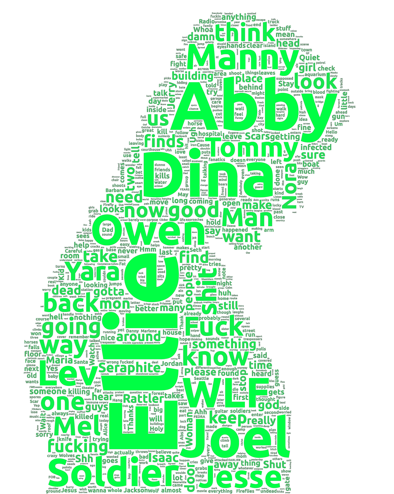
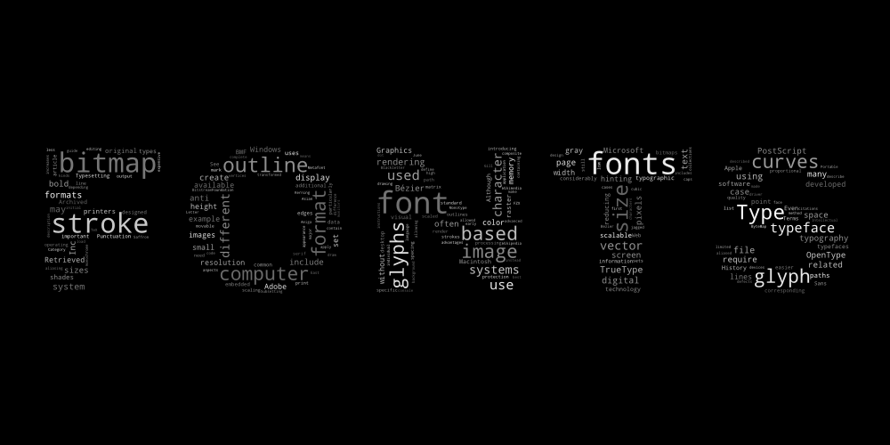

# wcloud
Generate beautiful word clouds with support for masks, custom fonts, custom coloring functions, and more.

## Installation

Currently, the only way to install `wcloud` is by [installing Rust](https://doc.rust-lang.org/cargo/getting-started/installation.html) and using Cargo.

`cargo install wcloud`


## Usage

`wcloud` can be used as both a command-line application and a library.

### Command-line

The binary runs under the `wcloud` name. The only required input is the text used to generate the word cloud, which can be provided via the `--text` flag or through `stdin`.

`$ wcloud --text file.txt -o cloud.png`

`$ echo 'Clouds are awesome!' | wcloud --output cloud.png`

For a list of all options, use `wcloud --help`.

### Library

`wcloud` can also be used as a Rust crate. `cargo add wcloud` to add it as a dependency. The documentation is available [here](https://docs.rs/wcloud).

Here's a basic example:

```rust
use wcloud::{WordCloud, WordCloudSize};

fn main() {
    let text = r#"
        An arcus cloud is a low, horizontal cloud formation,
        usually appearing as an accessory cloud to a cumulonimbus.
        Roll clouds and shelf clouds are the two main types of arcus
        clouds. They most frequently form along the leading edge or
        gust fronts of thunderstorms; some of the most dramatic arcus
        formations mark the gust fronts of derecho-producing convective
        systems. Roll clouds may also arise in the absence of
        thunderstorms, forming along the shallow cold air currents of
        some sea breeze boundaries and cold fronts.
    "#;

    let wordcloud = WordCloud::default()
        .with_rng_seed(0);

    let size = WordCloudSize::FromDimensions { width: 1000, height: 500 };
    let wordcloud_image = wordcloud.generate_from_text(text, size, 1.0);

    wordcloud_image.save("cloud.png")
        .expect("Unable to save image");
}
```


Examples of generating word clouds with masks, custom colors, and other features can be found in the `examples/` directory.

## Gallery

<p>


    

</p>

## Credit

This project is largely based on the [word_cloud](https://github.com/amueller/word_cloud) project by [@amueller](https://github.com/amueller/). Comparatively, `wcloud` is missing the following features:

- Color masks
- Mask contours
- Bigrams
- Colormaps
- Plural normalization

## License

`wcloud` is released under the [MIT License](https://github.com/isaackd/wcloud-dev/blob/main/LICENSE). The default `Ubuntu` font is included under the [Ubuntu Font License](https://github.com/isaackd/wcloud-dev/blob/main/fonts/Ubuntu-LICENCE.txt) and `Droid Sans Mono` under [Apache License 2](https://github.com/isaackd/wcloud-dev/blob/main/fonts/DroidSansMono-LICENCE.txt).
